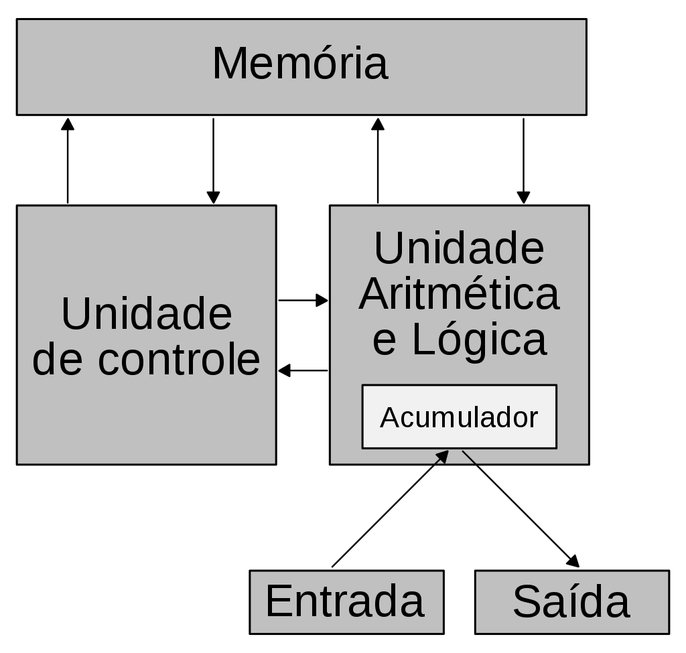

# Arquitetura de von Neumann

Data: 03/08/2023

A [[Arquitetura de von Neumann]] é uma arquitetura de máquina digital que possui:

- Memória
- Unidade Aritmética e Lógica (ALU)
- Unidade de Controle (CU)

Nesta arquitetura, a ALU executa o programa presente na memória sobre os dados recebidos na entrada.